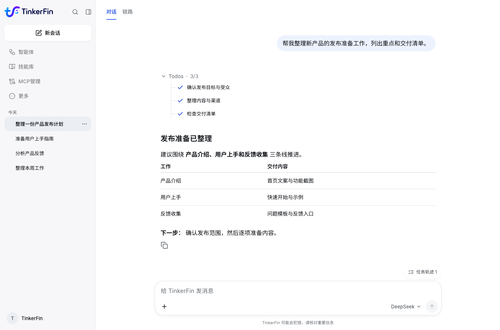
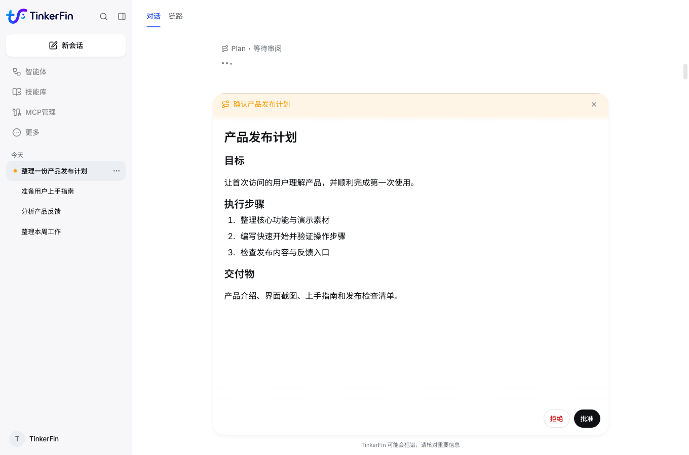
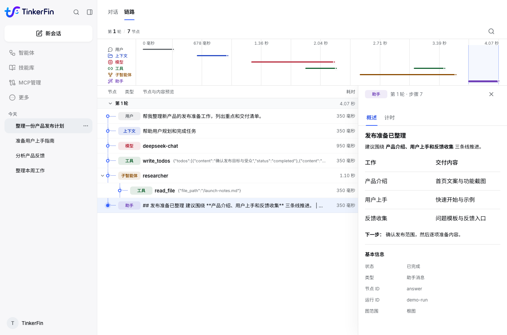

<p align="center">
  
</p>
<h1 align="center">TinkerFin</h1>
<p align="center"><strong>快速构建可交付的企业智能体应用。</strong></p>
<p align="center">
  <a href="README.md">English</a> · <a href="README.cn.md">简体中文</a> ·
  <a href="docs/cn/index.md">Documentation</a> · <a href="docs/cn/quick_start.md">Quick Start</a>
</p>
<p align="center">
  <a href="docs/cn/runtime/quick_start.md"></a>
  <a href="LICENSE"></a>
  <a href="https://github.com/tinkerfin-ai/tinkerfin/actions/workflows/packages-quality.yml"></a>
  <a href="docs/cn/index.md"></a>
</p>

**TinkerFin 是面向企业业务的智能体应用开发框架。** 围绕任务编排、人机协同、执行追踪与隔离运行，帮助团队将业务流程构建为**可规划、可执行、可追踪、可干预**的智能体应用。

从调研分析、文档整理到数据处理与文件生成，把模型能力接入你的业务流程。
**以 Python 框架构建应用核心，以 Studio 交付业务工作台**，从模型与工具集成，到用户交互、过程管理和结果交付，减少从零搭建应用基础能力的工作。



## 为业务落地而构建

- **面向完整应用交付** — 从智能体执行到用户工作台，提供前端交互、持久会话与文件产物管理。直接部署 Studio，或将框架集成到自己的业务系统。
- **复杂任务编排** — 将业务目标转成执行计划，协调工具与子智能体分工，持续呈现任务进度，让多步骤工作按计划推进。
- **人机协同决策** — 在计划审阅与关键工具操作中引入人工确认，支持批准、拒绝和停止运行，将业务判断纳入自动执行过程。
- **统一执行追踪** — 关联对话、模型、工具与子智能体的执行记录，集中查看调用关系、耗时和结果，为问题定位与流程优化提供依据。
- **持久会话与隔离执行** — 保存会话和事件，支持断线重连、输出回放与运行取消，并提供隔离的文件与命令执行环境，支撑需要持续跟进的业务任务。
- **自主部署与灵活集成** — 基于 Deep Agents，自选模型、业务工具和数据存储，通过 AG-UI 接入前端；按业务需要组合能力，掌握应用的部署环境与集成方式。

## Studio：面向业务的智能体工作台

### 将业务目标转为执行计划

业务目标先转成可审阅的计划，确认范围和步骤后再进入执行。



### 掌握任务执行过程

从业务对话一路追踪到模型、工具和子智能体，查看任务如何执行、时间花在哪里。



*以上为当前 Studio 界面的演示数据截图。*

## 快速开始

### 体验 Studio

准备 Docker 与 Docker Compose，再启动后端和 Web 客户端。初始账号为 `tinkerfin`，密码为 `123456`；登录后配置自己的模型。

[打开 Studio 上手指南 →](docs/cn/studio/quick_start.md)

### 接入 Python 框架

需要 Python 3.11 或更高版本。

```bash
pip install tinkerfin langchain-openai
```

配置模型密钥后，即可创建智能体并接收执行结果。

[运行第一个智能体 →](docs/cn/runtime/quick_start.md)

## 项目组成

| 部分 | 用途 |
| --- | --- |
| `packages/` | 企业智能体应用的核心框架，支撑任务编排、人机协同、执行追踪与隔离运行 |
| `apps/studio/` | 可部署、可扩展的智能体工作台，统一业务交互、计划审批与执行追踪 |
| `docs/` | 覆盖应用搭建、部署运维与深度集成的双语文档 |

## Documentation

[中文文档首页 →](docs/cn/index.md)

从应用搭建到部署运维，提供上手指南、架构说明与集成参考。

## 参与贡献

欢迎提交问题、改进文档或贡献代码。开发环境和验证命令见[开发指南](docs/cn/development.md)。

## License

仓库默认采用 [Apache License 2.0](LICENSE)。源自上游 LangGraph MySQL Store 的
`tinkerfin-langgraph-mysql` 采用包内 [MIT License](packages/tinkerfin-langgraph-mysql/LICENSE)
与 [NOTICE](packages/tinkerfin-langgraph-mysql/NOTICE)。
