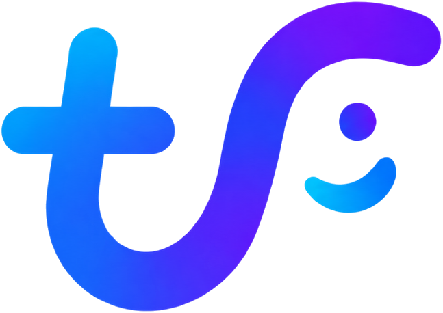
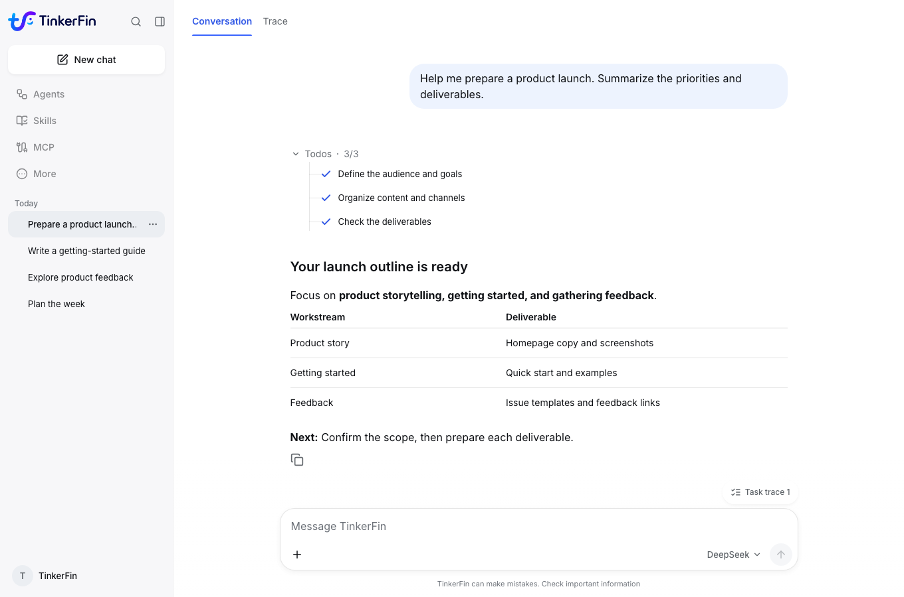
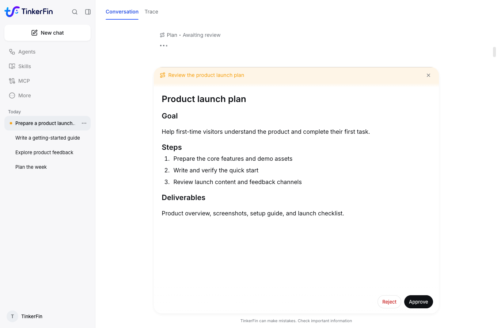
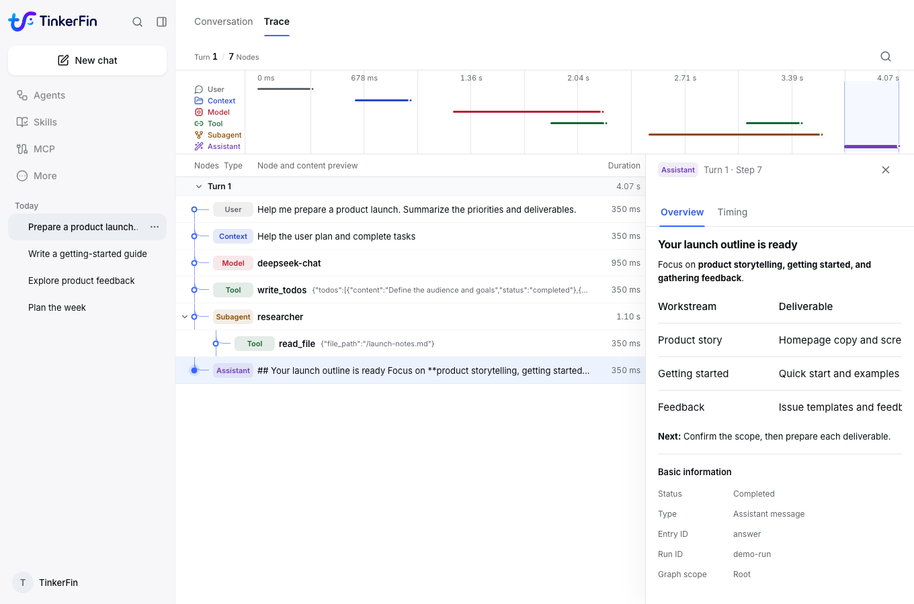

<p align="center">
  
</p>
<h1 align="center">TinkerFin</h1>
<p align="center"><strong>Build and deliver enterprise agent applications, faster.</strong></p>
<p align="center">
  <a href="README.md">English</a> · <a href="README.cn.md">简体中文</a> ·
  <a href="docs/en/index.md">Documentation</a> · <a href="docs/en/quick_start.md">Quick Start</a>
</p>
<p align="center">
  <a href="docs/en/runtime/quick_start.md"></a>
  <a href="LICENSE"></a>
  <a href="https://github.com/tinkerfin-ai/tinkerfin/actions/workflows/packages-quality.yml"></a>
  <a href="docs/en/index.md"></a>
</p>

**TinkerFin is an agent application framework built for enterprise workflows.** It combines task orchestration, human collaboration, execution tracing, and isolated environments to turn business workflows into applications that **plan, act, and keep people in control**.

Connect model capabilities to your business—from research and document workflows to data processing and file generation.
**Build the application core with Python and deliver the workspace with Studio.** Cover model and tool integration, user interactions, execution management, and results with less application infrastructure to build from scratch.



## Built for business workflows

- **Complete application delivery** — Connect agent execution to a user workspace with frontend interactions, persistent conversations, and file outputs. Deploy Studio directly or integrate the framework into your business systems.
- **Complex task orchestration** — Turn business goals into execution plans, coordinate tools and subagents, and follow progress as each step moves toward completion.
- **Human decisions in the workflow** — Require review for plans and selected tool operations. Support approval, rejection, and cancellation to keep business judgment part of automated execution.
- **Unified execution tracing** — Connect conversations, model calls, tools, and subagents in one execution record. Inspect relationships, timing, and results to diagnose issues and improve workflows.
- **Persistent conversations and isolated execution** — Store conversations and events, reconnect to receive output, replay streams, and cancel runs. Use isolated file and command environments for business tasks that need ongoing follow-up.
- **Deployment and integration on your terms** — Built on Deep Agents, with your choice of models, business tools, and storage. Connect frontends through AG-UI and compose the capabilities your application needs in your own environment.

## Studio: the workspace for business agents

### Turn business goals into execution plans

Turn a business goal into a reviewable plan, then confirm the scope and steps before execution.



### Understand how each task runs

Follow a business conversation through model calls, tools, and subagents to see how the task ran and where time was spent.



*Screenshots show the current Studio interface with demonstration data.*

## Quick Start

### Try Studio

Prepare Docker and Docker Compose, then start the backend and Web client. Sign in with the initial username `tinkerfin` and password `123456`, then configure your model.

[Open the Studio setup guide →](docs/en/studio/quick_start.md)

### Build with Python

Requires Python 3.11 or newer.

```bash
pip install tinkerfin langchain-openai
```

Set your model credentials, create an agent, and consume its output.

[Run your first agent →](docs/en/runtime/quick_start.md)

## Project layout

| Part | Purpose |
| --- | --- |
| `packages/` | Core framework for enterprise agent applications: task orchestration, human collaboration, execution tracing, and isolated environments |
| `apps/studio/` | A deployable, extensible agent workspace for business interactions, plan approval, and execution tracing |
| `docs/` | Bilingual documentation for application development, deployment, operations, and advanced integration |

## Documentation

[English documentation →](docs/en/index.md)

From application development to deployment and operations: getting-started guides, architecture documentation, and integration references.

## Contributing

Issue reports, documentation improvements, and code contributions are welcome. See the [development guide](docs/en/development.md) for environment setup and validation commands.

## License

[Apache License 2.0](LICENSE) is the repository default. The `tinkerfin-langgraph-mysql` package,
derived from the upstream LangGraph MySQL Store, uses its packaged
[MIT License](packages/tinkerfin-langgraph-mysql/LICENSE) and [NOTICE](packages/tinkerfin-langgraph-mysql/NOTICE).
