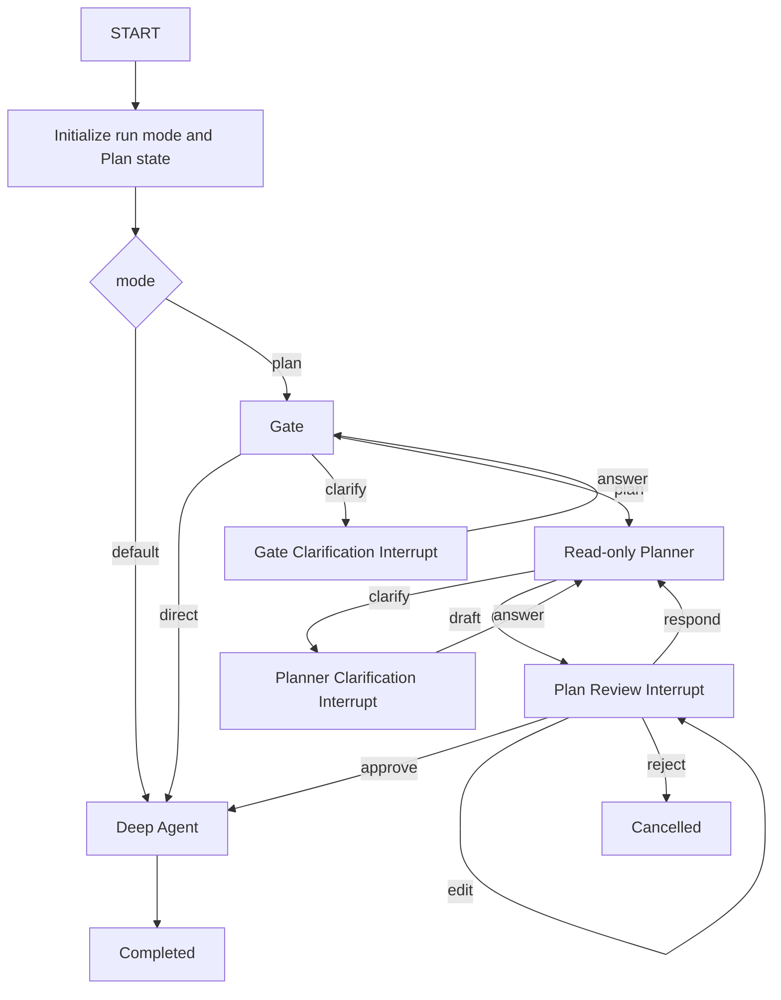

# TinkerFin Plan 能力、请求模式与 Studio 集成方案

## 1. 目标与边界

TinkerFin 为 Deep Agent Definition 提供可选的 Plan 能力。启用能力后，同一个 Definition、同一个 checkpoint thread 使用一张稳定父 Graph；用户可以逐次选择 `default` 或 `plan`，而不是切换 Graph Definition。

最终公共用法：

```python
agent = (
    TinkerFin(
        state_schema=AppState,
        run_coordinator=run_coordinator,
    )
    .plan(
        enabled=True,
        default_mode="default",
        gate_model="openai:gpt-5.4-mini",
        planner_model="openai:gpt-5.4",
    )
    .create_deep_agent(
        model="openai:gpt-5.4",
        tools=tools,
        state_schema=AgentSpecificState,
        checkpointer=checkpointer,
        store=store,
    )
)

runtime = agent.new_agui(
    identity=identity,
    mode="plan",  # 或 "default"
)

native_runtime = agent.new(
    identity=native_identity,
    mode="default",  # new 与 new_agui 使用相同模式合同
)
```

核心语义：

```text
.plan(enabled=True)
→ Definition 具备 Plan 能力

new/new_agui(mode=...)
→ 用户选择本次新请求的运行模式

default
→ 绕过 Gate，直接运行 Deep Agent

plan
→ 进入 Gate，由 Gate 选择 direct / clarify / plan
```

非目标：

- 不通过切换普通与 Plan Definition 实现 mode 切换
- 不把 mode 放进调用方 state schema
- 不修改 Deep Agents `create_deep_agent(...)` 参数
- 不取消或弱化 Tool/Filesystem HITL
- 不实现 StageRun、Stage Guard、Final Guard 或执行中自动重规划
- 不新增数据库列
- 不兼容可丢弃的历史 checkpoint 或 pending interrupt
- 不为未公开旧 API 保留 alias、双写或隐藏 fallback

## 2. 客观事实基线

以下事实是实现依据，不得以模型记忆或私有反射替代。

### 当前仓库

- `TinkerFin` 当前工作树已提供构造器级 `state_schema` 与不可变 `.plan(...)`；源码公共 API 不保留旧 options 型 Plan 开关
- `DeepAgentDefinition.new()` 与 `new_agui()` 当前工作树已接受 `mode`，普通 Definition 拒绝 `plan`，Runtime 禁止调用方覆盖框架保留 mode
- Plan-capable Definition 当前工作树始终创建稳定父 Graph；`default` 绕过 Gate，`plan` 进入 Gate
- 动态 clarification option/answer、Plan interrupt metadata 与 Plan Review 基础合同已实现
- Plan Graph 已使用独立 `clarify_gate` 与 `clarify_planner` 节点，回答后分别返回 Gate 与 Planner；interrupt metadata 记录对应 source
- Studio 当前工作树已定义 conversation 级 `AgentMode = "default" | "plan"`，并在每次 start/resume 请求中发送 `forwardedProps.mode`
- Studio 服务端当前工作树已校验 mode、写入 `PreparedRunRequest` 并传给 `definition.new_agui(mode=...)`
- Studio run 配置已保存 forwarded props，可从最近权威 run 恢复 mode，无需数据库迁移；该恢复链路仍需联合测试
- `ResumeMapper` 已把全部 `status=cancelled` 分类为 abandon，abandon 不生成 `Command(resume=...)`

### 锁定依赖

- Deep Agents 0.7.5
- LangGraph 1.2.10
- LangChain 1.3.14
- LangChain Core 1.5.3
- AG-UI protocol 0.1.19

依赖源码事实：

- Deep Agents 把显式 `state_schema` 与有效 middleware 的公开 `state_schema` 交给 LangChain
- LangChain `create_agent` 合并 middleware state schema 与显式 base state
- `DeepAgentState.messages` 使用 `DeltaChannel`，不能退化成普通 list reducer
- Filesystem、Todo、Skills、Memory 等能力通过 middleware state 扩展
- 当前锁定版本的 compiled graph output schema 不能可靠表达包含 `NotRequired` / `OmitFromSchema` 的完整 Deep Agent root schema
- interrupt 必须通过同一 `thread_id` 和具体 checkpointer 恢复
- Store 与 checkpoint 是不同边界：checkpoint 保存 thread 执行状态，Store 服务 backend、tool 和跨 thread 数据

### 官方产品行为参考

OpenAI Docs 将 `/plan` 定义为当前 chat 的 mode toggle，并明确 Codex 工作中暂不可切换。该产品行为只用于确认用户预期；TinkerFin 的 Plan interrupt、checkpoint 和 resume 仍以锁定 LangGraph/Deep Agents 行为为准。

## 3. Definition 能力与 Run 模式

### 客观事实

`.plan(enabled=True)` 在 Definition 创建前调用，只能表达 Agent 是否具备 Plan 能力，不能表达下一条用户消息的 mode。

### 最终合同

```python
AgentMode = Literal["default", "plan"]


class TinkerFin:
    def __init__(
        self,
        *,
        run_coordinator: RunCoordinator | None = None,
        state_schema: type[DeepAgentState] | None = None,
    ) -> None: ...

    def plan(
        self,
        *,
        enabled: bool = True,
        default_mode: AgentMode = "default",
        gate_model: str | BaseChatModel | None = None,
        planner_model: str | BaseChatModel | None = None,
    ) -> TinkerFin: ...
```

规则：

- TinkerFin 与 `.plan(...)` 返回对象都是可安全共享的 Definition factory
- `.plan(...)` 返回新的不可变配置快照，不修改来源对象
- `enabled` 必须是严格 bool
- `enabled=False` 清除派生 factory 的 Plan 配置
- disabled 时传入非默认 `default_mode`、Gate 或 Planner 模型提前报错
- Gate/Planner 模型未指定时继承执行模型
- 公开 API 不导出 Plan 配置对象；内部使用冻结、slots 化值对象
- `state_schema` 只影响通过该 factory 创建的 Deep Agent Definition，不影响 `TinkerFin.run(...)`

```python
class DeepAgentDefinition:
    def new(
        self,
        *,
        identity: Identity,
        mode: AgentMode | None = None,
        ...,
    ) -> DeepAgentRuntime:
        ...

    def new_agui(
        self,
        *,
        identity: Identity,
        mode: AgentMode | None = None,
        ...,
    ) -> DeepAgentAgUiRuntime:
        ...
```

规则：

- `mode=None` 使用 Definition 冻结的 default mode
- Plan-capable Definition 接受 default 和 plan
- 普通 Definition 仅接受 default；传 plan 提前报配置错误
- mode 在 Runtime 创建时冻结
- Runtime 把 mode 绑定到框架保留 configurable
- 调用方不能在 `astream(config=...)` 覆盖已绑定 mode
- mode 不属于调用方 state，不要求 Studio 理解 LangGraph configurable

### 影响面

- `../packages/tinkerfin` public facade、Runtime/Definition binding、错误类型、stubs
- 当前仓库所有旧 Plan 开关调用、示例和测试
- `create_deep_agent(...)` 参数、普通 run API、Sandbox API 不变

### 必须验证

- 不可变 clone 与 coordinator/state schema 保留
- strict bool、mode/default mode、disabled 参数组合
- bound `create_deep_agent` 签名严格等于 Deep Agents 0.7.5
- Pyright/PyCharm 链式类型和生成 stub

## 4. 稳定父 Graph 与模式路由

### 客观事实

同一 checkpoint thread 不能通过切换普通 Graph 与 Plan Graph 安全表达 mode；两者的节点、state schema 和 interrupt namespace 不同。Plan-capable Definition 必须始终编译同一 topology。

### 最终合同



稳定节点：

```text
START
initialize_run
route_mode
plan_gate
clarify_gate
create_plan
clarify_planner
review_plan
execute_deep_agent
complete_run
END
```

路由规则：

- default 必须直接进入 Deep Agent，不调用 Gate 或 Planner
- plan 必须进入 Gate
- plan 下 Gate 保留 direct、clarify、plan
- mode 只改变 START 后路由，不改变节点集合或 state schema
- 同一 thread 可按 `plan → default → plan` 连续运行

### 新请求初始化

普通用户输入从 START 开始时重置上一轮 Plan 瞬态：

- route
- requirement questions/answers
- draft
- confirmed plan
- review action
- feedback
- revision
- 本轮状态与错误

必须保留：

- messages
- files
- todos
- 调用方 state
- Store 数据

`Command(resume=...)` 从 interrupt checkpoint 恢复，不重新经过 START，也不得清理正在等待处理的 Plan。

### 影响面

- Plan workflow builder、父 Graph state、Runtime configurable binding
- checkpoint topology 和子图 namespace 保持稳定
- Gate、Planner、Deep Agent 不依赖 Studio

### 必须验证

- default 不产生任何 Gate/Planner 调用
- plan 保持现有 Gate/Planner/Review 路径
- mode 往返不丢 state/Store/context
- default 新请求不注入旧 ConfirmedPlan
- interrupt resume 不错误触发 initialize_run

## 5. State 自动组合与 Context

### 客观事实

Plan 父 Graph 当前只扩展调用级 state schema，Deep Agent middleware 后加的 files/todos 等字段不能依赖 compiled graph 私有结构发现；Studio 任务抽屉需要稳定 root-visible state。

### 最终合同

独立 `StateSchemaComposer` 在 Definition 创建阶段组合：

```text
DeepAgentState
+ TinkerFin(state_schema)
+ create_deep_agent(state_schema)
+ 调用方 middleware.state_schema
+ Deep Agents 稳定 root-visible state（messages / files / todos）
+ tinkerfin_plan（Plan-capable Definition）
```

规则：

- default 与 plan 使用同一份最终 schema
- 保留 `Annotated` metadata、reducer、Required/NotRequired 和 input/output omission metadata
- 完全相同的继承字段去重
- 同名字段的类型、reducer、requiredness 或 metadata 不一致时提前报错
- `tinkerfin_plan` 为框架保留字段
- messages 保留 Deep Agents DeltaChannel
- files/todos 在父 Graph 根 state 可见
- private middleware scratch state 不投影 AG-UI
- 禁止读取 compiled graph 私有 builder、channels 或非公开 schema
- 新上游版本出现必须投影字段时，先增加锁定版本 contract test，再扩展 composer

Context 规则：

- `context_schema` 继续来自 `create_deep_agent(...)`
- context 不与 state 合并，不写 checkpoint
- 同一 runtime context 传给 Gate、Planner、Plan nodes 和 Deep Agent

### 影响面

- 独立 Plan state/composer 模块、workflow factory、根 state snapshot
- AG-UI adapter 只消费公开 root values，不负责 schema 组合
- Studio 无需声明 `StudioAgentState`

### 必须验证

- messages/files/todos/custom fields round-trip
- reducer 与 omission metadata 保留
- 冲突提前失败且错误指出字段与来源
- private state 不进入公开 AG-UI payload
- context 各节点一致且不进入 checkpoint

## 6. Checkpointer、Store、Cache 与 Backend 所有权

### 客观事实

现有 MVP 已把具体 checkpointer/store/cache 交给父 Graph，内嵌 Deep Agent 使用 `None` 继承；StoreBackend 需要父 runtime Store，StateBackend 文件依赖 thread state。

### 最终合同

```text
Parent Plan Graph
├── owns checkpointer
├── owns store binding
├── owns cache
├── owns interrupt/resume lifecycle
└── embeds Deep Agent
    ├── checkpointer=None
    ├── store=None
    └── cache=None
```

规则：

- mode 切换不改变所有权
- backend 保留调用方对象，不被 Plan 替换
- Plan interrupt 与 Tool HITL 使用同一父 checkpointer 和 thread
- StoreBackend/CompositeBackend 继续从父 runtime 获取 Store
- 取消、异常、断连只产生一个主终止事件
- `CancelledError` 清理后继续传播

### 影响面

- workflow compile、Backend runtime、checkpoint namespace
- 普通非 Plan Definition 所有权不变

### 必须验证

- 父/子资源配置和 namespace
- same-thread files、cross-thread Store
- interrupt 前同步 durability
- 正常、异常、取消终止唯一性

## 7. Dynamic Clarification 与 Plan Review

### 客观事实

当前 MVP clarification 只有自由输入；Studio 需要模型根据问题动态给出可选项。Plan Review 的四种业务动作已经固定，不能与 Tool approve/edit/reject 混为一套 UI。

### 最终合同

```python
class ClarificationOption:
    id: str
    label: str
    description: str | None = None


class ClarificationQuestion:
    id: str
    prompt: str
    options: tuple[ClarificationOption, ...] = ()
    allow_custom_answer: bool = True
```

规则：

- Gate 或 Planner 动态生成 options
- 首版仅单选
- `allow_custom_answer=True` 允许直接输入文本
- `allow_custom_answer=False` 必须至少有一个 option
- question/option ID 在当前 interrupt 内唯一稳定
- answer 必须引用当前 pending question
- Gate clarification 回 Gate，Planner clarification 回 Planner

Plan Review 固定动作：

- approve：冻结 ConfirmedPlan 并进入 Deep Agent
- edit：验证完整 Draft/base revision，增加 revision 后再次 Review
- respond：把自然语言反馈交回 Planner
- reject：cancelled 结束，不执行 Deep Agent

ConfirmedPlan 通过独立 middleware 注入 system request，不制造隐藏 conversation message。

### 影响面

- Plan Pydantic 边界模型、planner structured output、runtime interrupt payload
- Studio PlanQuestionCard/PlanReviewCard
- Tool ApprovalCard 不复用 Plan 业务模型

### 必须验证

- 动态选项、自由输入、无效/过期 ID
- approve/edit/respond/reject 和 stale revision
- state snapshot → messages snapshot → interrupt terminal 顺序

## 8. Studio mode 与历史恢复

### 客观事实

Studio 已发送 `forwardedProps.mode`，但 mode 当前是 workspace 级 React state，服务端不参与 Graph 分支。

### 最终合同

- 复用现有 `default | plan` 请求字段，不新增平行字段
- 服务端把校验后的 mode 显式传给 `definition.new_agui(...)`
- Studio 创建 Plan-capable Definition；用户 mode 决定本轮路由
- 新 thread 初始 mode 为 default
- mode 属于 conversation/thread，不在不同 thread 间串用
- 每次权威 RUN_STARTED 后，从 input.forwardedProps.mode 更新 conversation mode
- 历史恢复从最近 run 的现有 config/input 恢复 mode
- 不新增数据库列

### 影响面

- Studio web Conversation model、Workspace selector、history hydration
- Studio server request preparation、Agent factory、history projection
- 模型目录、Sandbox、认证与数据库 schema 不变

### 必须验证

- thread A/B 模式隔离
- plan/default 请求端到端到达 Runtime
- 刷新和历史 hydration 恢复最后成功启动 run 的 mode
- 未知 mode 在服务端提前拒绝

## 9. Mode 切换与两类 HITL

### 9.1 已完成或空闲

**客观事实**：没有 pending interrupt 时，下一条普通输入可以从 START 使用新的 mode。

**合同**：selector 变化立即成为当前 thread 偏好；下一条消息使用新 mode。

**影响面**：仅前端 conversation mode 与下一次 Runtime binding。

**验证**：同一 thread plan 完成后切 default，下一条消息绕过 Gate；反向切换进入 Gate。

### 9.2 Plan Clarification / Review pending

**客观事实**：全部 cancelled 已能映射为 abandon；abandon 不等于 reject，也不执行 pending Plan。

**合同**：

```text
用户切 default
→ 确认关闭当前 Plan
→ 提交全部 Plan interrupt 为 cancelled
→ 服务端原子 claim
→ 不创建 Command(resume=...)
→ 当前 Plan run cancelled
→ 下一条普通消息以 default 开新 run
```

仅允许公开 kind 为 Plan clarification/review 的 pending 批次使用该流程。

**影响面**：Plan cards、resume payload、run registration、interrupt projection。

**验证**：不伪造 approve/reject/respond；并发正常 resume 与 abandon 只能一个成功；失败时释放 claim。

### 9.3 Tool / Filesystem HITL pending

**客观事实**：Tool HITL 来自 Deep Agent `interrupt_on`，不是 Plan 审批。

**合同**：Plan selector 不取消、不批准、不拒绝 Tool interrupt。用户可修改未来 mode 偏好，但当前 Tool run 必须按原审批或取消流程处理；default 模式仍可能触发 Tool HITL。

**影响面**：现有 ApprovalCard、Tool ResumeMapper 和安全策略保持不变。

**验证**：切 mode 后 Tool interrupt 仍 pending；处理完成后下一条消息使用新 mode。

### 9.4 Active streaming

**客观事实**：运行中改变 START 路由无法作用于已开始的 Graph；Codex 也在工作时禁用 Plan toggle。

**合同**：active streaming 禁用 selector；用户必须等待完成，或显式取消并等待资源清理后再切换。禁止自动取消和并发第二个 run。

**影响面**：Studio disabled state、现有 cancel lifecycle、Messaging owner。

**验证**：取消完成前无法启动新 run；取消事件唯一且资源释放。

## 10. AG-UI 与模块边界

### 客观事实

AG-UI adapter 已有 Tool interrupt/resume 与通用 runtime interrupt 基础。框架包不能依赖 Studio，Studio 也不能复制 Plan state machine。

### 最终合同

- `tinkerfin.plan` 独立承载配置、模型、state、prompts、middleware 和 workflow
- Runtime/deep_agent facade 只绑定不可变配置和 factory
- adapter 只转换真实 v2 `messages/tasks/values` 与 interrupt/resume
- Plan interrupt 通过稳定公开 kind 交给 Studio
- Studio server 只做业务请求、持久化和 Runtime 调用
- Studio web 根据 interrupt kind 选择 PlanQuestionCard、PlanReviewCard 或 ApprovalCard
- provider private reasoning 继续从公开 state/message/rawEvent 剥离
- 主 run 只发布一个 terminal

### 影响面

- tinkerfin、tinkerfin-agui-adapter、Studio server/web
- tinkerfin-messaging 只做回归，不改协议
- tinkerfin-sandbox 不改框架合同

### 必须验证

- `version="v2"`、`stream_mode=["messages", "tasks", "values"]`、`subgraphs=True`
- root/subgraph namespace、完整 message/tool/run ID
- text/reasoning/tool Start/Content/End 配对与 args 增量
- Plan/Tool interrupt、resume、cancel、快照顺序和唯一 terminal
- 重试重复事件、幂等、历史重放和未知事件处理

## 11. 实施顺序

- [x] 创建并维护 `../.agents/plan` 二阶段执行计划
- [x] 将本文整理为唯一决策基线
- [x] 重构 TinkerFin state schema 与 `.plan(...)` API
- [x] 增加 Definition/Runtime mode binding
- [x] 实现 StateSchemaComposer
- [x] 重构稳定 mode shell；Gate/Planner clarification 的独立返回路径归入下一项
- [x] 拆分 Gate/Planner clarification 返回路径，并完成动态 clarification/review 合同与真实 v2→AG-UI 流合同
- [x] 完成 Studio server mode、权威历史恢复与 Plan-only abandon 联合验证
- [x] 完成 thread mode、PlanQuestionCard、PlanReviewCard 与 active/pending 联合验证
- [x] 更新 stubs、当前调用方和中英文文档，统一为 `.plan(...)` 与请求级 mode
- [x] 完成定向与相关全量验证

## 12. 不兼容影响、回滚和完成标准

不兼容影响：

- 移除旧 options 型 Plan 开关
- 新增 `TinkerFin(state_schema=...)` 与 `.plan(...)`
- 新增 `new/new_agui(mode=...)`
- 不公开 Plan 配置对象
- 当前仓库调用方、测试、stubs、README 和中英文文档一次性更新
- 历史 checkpoint 不保证恢复，部署前清理或隔离旧数据

回滚：

- 二阶段 API、mode shell、Studio mode binding 与 Plan cards 作为一组回到已验证 MVP
- 不复用二阶段写入的测试/本地 checkpoint
- 不通过 alias、双写、fallback 或两套 Graph 并存回滚
- 普通 `TinkerFin().create_deep_agent(...)` 必须始终可独立回归

完成标准：

- 用户可在同一 thread 的下一轮自由选择 default 或 plan
- default 真正绕过 Gate，plan 保留 Gate
- 关闭 Plan 不再产生 Plan-specific HITL，但不影响 Tool/Filesystem HITL
- mode 不改变 Graph topology、state schema、checkpointer 或 Store
- state/context/interrupt/AG-UI 合同均有锁定版本 contract test
- Studio 模式、Plan questions/review、Tool ApprovalCard 联合行为通过
- 格式、Lint、Pyright、stub check、相关 pytest、前端 lint/test 全部通过
